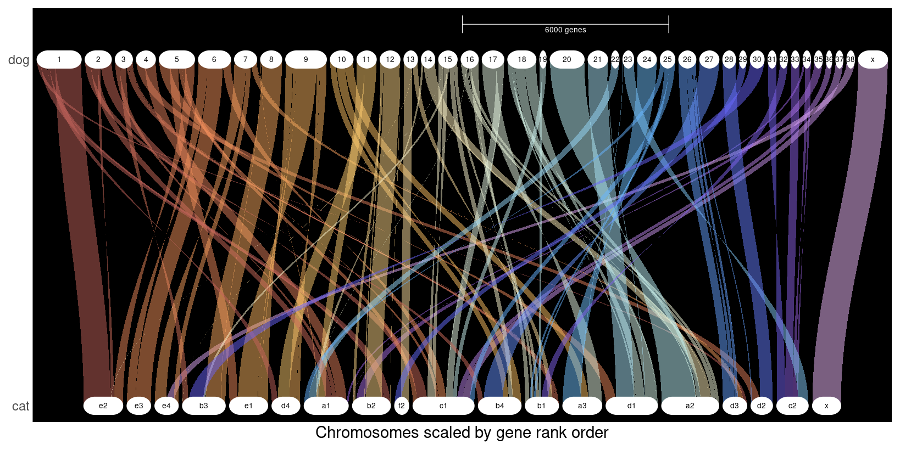

# Genespace For Beginners
## Intro
GENESPACE is a super cool tool that has a variety of functions, but in this tutorial we'll show you how to use it to visualize synteny between different species.

<details>
<summary><strong> Part 1: </strong> Installation and Environment Setup </summary>
We will execute GENESPACE in the R environment, but it requires several dependencies that are usually best installed and run on a high performance cluster or server, rather than on your local machine.

### 1. R
GENESPACE is meant to be run interactively in the R environment for statistical computing. So, you need to have R installed. See [CRAN](https://www.r-project.org/) for the most recent release.

### 2. Orthofinder
OrthoFinder (which includes `DIAMOND2`) is most simply installed via conda (in the shell, not R).
```{bash}
conda create -n orthofinder
conda activate orthofinder
conda install -c bioconda orthofinder=2.5.5
```
If conda is not available on your machine, you can install orthofinder from a number of other sources. See orthofinder documentation for details.
Regardless of how OrthoFinder is installed, ensure that you have OrthoFinder version >= 2.5.4 and DIAMOND version >= 2.0.14.152.

### 3. MCScanX
`MCScanX` should be installed from [github](https://github.com/wyp1125/MCScanX).

### 4. GENESPACE
Once the above dependencies are installed, start an R instance. If you made a conda environment, its useful to open R directly from that environment so that OrthoFinder stays in the path.
```{bash}
conda activate orthofinder
R
```
Once in R, the easiest way to install GENESPACE uses the package devtools (which may need to be installed separately):
```{R}
if (!requireNamespace("devtools", quietly = TRUE))
    install.packages("devtools")
devtools::install_github("jtlovell/GENESPACE") 
```
Depending on your cluster, you may need to add 'force = TRUE' to the end of the GENESPACE installation command.

### 5. Install R dependencies
If they are not yet installed, install_github will install a few dependencies directly (ggplot2, igraph, dbscan, R.utils, parallel). However, you will need to install the bioconductor packages separately:
```{R}
if (!requireNamespace("BiocManager", quietly = TRUE))
    install.packages("BiocManager")
BiocManager::install(c("Biostrings", "rtracklayer"))

library(GENESPACE)
```
</details>

<details>
<summary><strong> Part 2: </strong> Preparing the Required Input Files </summary>

GENESPACE requires two input files per genome. These files must be consistent with each other (same annotation, matching gene IDs). 

### 1. Genome annotation (`.gff3`)
- GFF3 file describing where genes and their features are located in the genome assembly
- Includes positions for genes, transcripts, exons, and CDS regions.
- Must be valid GFF3 format (not all .gff files are compliant). GFF versions are listed in the headers of the files.

Key fields:
- Feature type (gene, mRNA, CDS, etc.)
- Start and end positions
- Strand (+ or -)
- Attributes (e.g., gene IDs)

Example:
```{text}
chr1  source  gene  1000  5000  .  +  .  ID=gene1
```

### 2. Protein sequences (`.faa`)
- FASTA file containing translated protein sequences from coding regions (CDS).
- Used for sequence similarity searches (e.g., DIAMOND) to identify homologous genes.

Example:
```{text}
>gene1
MTEYKLVVVGAGGVGKSALTIQLIQ...
```

### How these files relate
Each file represents a different layer of information:
- `.gff3` → the gene locations and structure
- `.faa` → the protein sequences encoded by those genes

GENESPACE links these together to identify orthologs and syntenic regions across genomes.

### Critical requirements
- Matching IDs: Gene/transcript IDs in the `.gff3` must match sequence headers in the `.faa`.
- Same annotation source: Files must come from the same genome build and annotation version.
- Consistent naming: Chromosome/contig names in `.gff3` must match those in `.fna`.
- Valid GFF3: Improperly formatted GFF files are a common source of errors. See GENESPACE website for more details.
</details>

<details>
<summary><strong> Part 3: </strong> Running GENESPACE! </summary>

**NOTE:** the following scripts and tutorials assume annotations in the NCBI. If you have genomes annotated with other software, see the [GENESPACE documentation](https://github.com/jtlovell/GENESPACE) or call 411-John-Lovell for help. 

Now that we've installed all necessary packages and environments, we are ready to run GENESPACE!

### Step 1: Establish your directory structure
Each species or individual genome that you want to analyze should have its own folder. Note that, the genomes do not have to be in the genespace folder you are working in, but, they must be labeled. Here is an example below using two different species:
```text
genespace_run/
└── genome_files
    ├── species1
    │   ├── species1.gff
    │   ├── species1.faa
    ├── species2
    │   ├── species2.gff
    │   ├── species2.faa
```

### Step 2: Parse Annotations
Parse the annotations to fastas with headers that match a gene bed file. We are assuming the directory structure above. Use the built-in `parse_annotations` function in R:
```{R}
library(GENESPACE)

genomeRepo <- "~/path/to/genespace_run/genome_files"
wd <- "~/path/to/genespace_run/"
path2mcscanx <- "~/path/to/MCScanX/"

genomes2run <- c("species1", "species2")

parsedPaths<- parse_annotations(
  rawGenomeRepo = genomeRepo,
  genomeDirs = genomes2run,
  genomeIDs = genomes2run,
  presets = "ncbi",
  genespaceWd = wd)
```

### Step 3: Initialize GENESPACE Run
The function `init_genespace` does most of the heavy lifting in terms of checking to make sure that the input data is OK. It also produces the correct directory structure and corresponding paths for the GENESPACE run. 

```{R}
genomeIDs <- sub("\\.bed$", "", list.files(file.path(wd, "bed"), pattern = "\\.bed$"))

gpar <- init_genespace(
  genomeIDs = genomeIDs,		       
  wd = wd, 
  path2mcscanx = path2mcscanx)
```

### Running GENESPACE
We're now ready to actually run GENESPACE. Depending on parameter settings and genome size, this can take anywhere from a few min to several hours. 
```{R}
out <- run_genespace(gpar)
```

## Results
GENESPACE produces a structured output directory containing intermediate files and final results. Below is a brief description of the main folders:
```{bash}
bed/             → Gene coordinate files in BED format (derived from GFF3)
dotplots/        → Pairwise synteny dotplots between genomes
orthofinder/     → Orthogroup inference results (from OrthoFinder)
pangenes/        → Pangenome gene sets and clustering results
peptide/         → Processed protein sequences used in comparisons
rds/             → R serialized objects for downstream analysis/plotting
results/         → Final summarized outputs (core GENESPACE results)
riparian/        → Intermediate data for synteny graph construction
syntenicHits/    → Identified syntenic gene pairs across genomes
tmp/             → Temporary working files (can usually be ignored)
```
</details>

<details>
<summary><strong> Part 4: </strong> Plots are what we live for </summary>

### Changing GENESPACE Synteny Plots
Once you visualize your first plot, you may want to change the species order, or change the orientation of some chromosomes. We can do this easily in GENESPACE!

Here is an example of a Riparian plot of Panthera (which are highly syntenic) before any customizations:


If we want to change the order of these species, we can use the `genomeIDs` parameter in the `plot_riparian` function. As a note, the first listed species is going to be the one appearing at the bottom of the plot, and the last listed here will be the top:
```{R}
# plot BASE PAIR riparian
# changing useOrder to TRUE will result in gene order plot
rip <- plot_riparian(
  gsParam = out,
  useOrder = FALSE, 
  refGenome = "domestic_cat",
  genomeIDs = c(
    "snow_leopard",
    "tiger",
    "leopard",
    "lion",
    "jaguar",
    "clouded_leopard",
    "domestic_cat"
  )
```
That then outputs this plot: 

We can also customize the order of the chromosomes, like so: 
```{R}
rip <- plot_riparian(
  gsParam = gparam,
  useOrder = FALSE,
  refGenome = "domestic_cat",
  genomeIDs = c(
    "snow_leopard",
    "tiger",
    "leopard",
    "lion",
    "jaguar",
    "clouded_leopard",
    "domestic_cat"
  ),
  customRefChrOrder = c(
    "A1","A2","A3",
    "B1","B2","B3","B4",
    "C1","C2",
    "D1","D2","D3","D4",
    "E1","E2","E3",
    "F1","F2",
    "X"
  ),
)
```
You can see that change here: 

Let's say that we also want to change the order of 2 chromsomes/scaffolds in the leopard, and 2 in jaguar. We can do this by first identifying those genomic regions:
```{R}
# identify the regions
invars <- list(
  leopard = c("79", "190"),  
  jaguar = c("6", "10")
)
# convert to format acceptible by GENESPACE
invchr <- data.table(
  genome = rep(names(invars), lengths(invars)),
  chr = unlist(invars)
)
```
And then adding it to the plotting function:
```{R}
rip <- plot_riparian(
  gsParam = gparam,
  useOrder = FALSE,
  refGenome = "domestic_cat",
  genomeIDs = c(
    "snow_leopard",
    "tiger",
    "leopard",
    "lion",
    "jaguar",
    "clouded_leopard",
    "domestic_cat"
  ),
  customRefChrOrder = c(
    "A1","A2","A3",
    "B1","B2","B3","B4",
    "C1","C2",
    "D1","D2","D3","D4",
    "E1","E2","E3",
    "F1","F2",
    "X"
  ),
  invertTheseChrs = invchr
)
```
After cleaning everything up you might get a plot that looks like this:

</details>

<details>
<summary><strong> Part 5: </strong> Now it's your turn! </summary>

In this section, we will look at synteny between cats and dogs using publicly avaialable data. 

<p align="left">
  
  <br>
  <em>Attempts at synteny between a cat and dog 
      prior to the invention of GENESPACE.</em>
</p>

# 1. Set up directories

```{bash}
mkdir -p genome_files/cat
mkdir -p genome_files/dog
mkdir -p genespace_run
```

Your project will look like this:

```text
project/
├── genome_files/
│   ├── cat/
│   └── dog/
└── genespace_run/
```
---
# 2. Download NCBI annotation files

## Cat

```{bash}
cd genome_files/cat

wget https://ftp.ncbi.nlm.nih.gov/genomes/all/GCF/016/509/475/GCF_016509475.1_Fcat_Pben_1.1_paternal_pri/GCF_016509475.1_Fcat_Pben_1.1_paternal_pri_genomic.gff.gz

wget https://ftp.ncbi.nlm.nih.gov/genomes/all/GCF/016/509/475/GCF_016509475.1_Fcat_Pben_1.1_paternal_pri/GCF_016509475.1_Fcat_Pben_1.1_paternal_pri_translated_cds.faa.gz

cd ../
```

## Dog

```{bash}
cd dog/

wget https://ftp.ncbi.nlm.nih.gov/genomes/all/GCF/014/441/545/GCF_014441545.1_ROS_Cfam_1.0/GCF_014441545.1_ROS_Cfam_1.0_genomic.gff.gz

wget https://ftp.ncbi.nlm.nih.gov/genomes/all/GCF/014/441/545/GCF_014441545.1_ROS_Cfam_1.0/GCF_014441545.1_ROS_Cfam_1.0_translated_cds.faa.gz

cd ../..
```

After downloading, the directory should look like this:

```text
genome_files/
├── cat/
│   ├── GCF_016509475.1_Fcat_Pben_1.1_paternal_pri_genomic.gff.gz
│   └── GCF_016509475.1_Fcat_Pben_1.1_paternal_pri_translated_cds.faa.gz
└── dog/
    ├── GCF_014441545.1_ROS_Cfam_1.0_genomic.gff.gz
    └── GCF_014441545.1_ROS_Cfam_1.0_translated_cds.faa.gz
```

---

# 3. Parse annotations with GENESPACE

Now we will use `parse_annotations()` to convert the NCBI files into the input format required by GENESPACE.

```{r}
library(GENESPACE)

genomeRepo <- "genome_files"
wd <- "genespace_run"

genomes2run <- c("cat", "dog")

parsedPaths <- parse_annotations(
  rawGenomeRepo = genomeRepo,
  genomeDirs = genomes2run,
  genomeIDs = genomes2run,
  presets = "ncbi",
  genespaceWd = wd
)
```

This should create:

```text
genespace_run/
├── bed/
│   ├── cat.bed
│   └── dog.bed
└── peptide/
    ├── cat.fa
    └── dog.fa
```

The `bed/` files contain gene coordinates, and the `peptide/` files contain protein sequences with matching IDs.

---

# 4. Initialize GENESPACE

Update `path2mcscanx` to match the location of MCScanX on your system.

```{r}
path2mcscanx <- "/path/to/MCScanX"

genomeIDs <- c("cat", "dog")

gpar <- init_genespace(
  genomeIDs = genomeIDs,
  wd = wd,
  path2mcscanx = path2mcscanx
)
```

---

# 5. Run GENESPACE

```{r}
out <- run_genespace(gpar)
```

This step will run orthology inference and synteny detection.

Depending on your system, this may take several minutes.

---

# 6. Riparian Plot Visualization
You can view the riparian plots auto-generated by GENESPACE in:

```text
genespace_run/
├── riparian/
```
We can also directly visualize using:

```{r}
ripDat <- plot_riparian(
  gsParam = out, 
  refGenome = "dog", 
  forceRecalcBlocks = FALSE)
```

If you have done everything correctly you should see the following:
<details>
<summary><b>Expected output with dog gene order as reference</b></summary>



</details>

Using modifications of the previous command, you can replot to your heart's content. 
