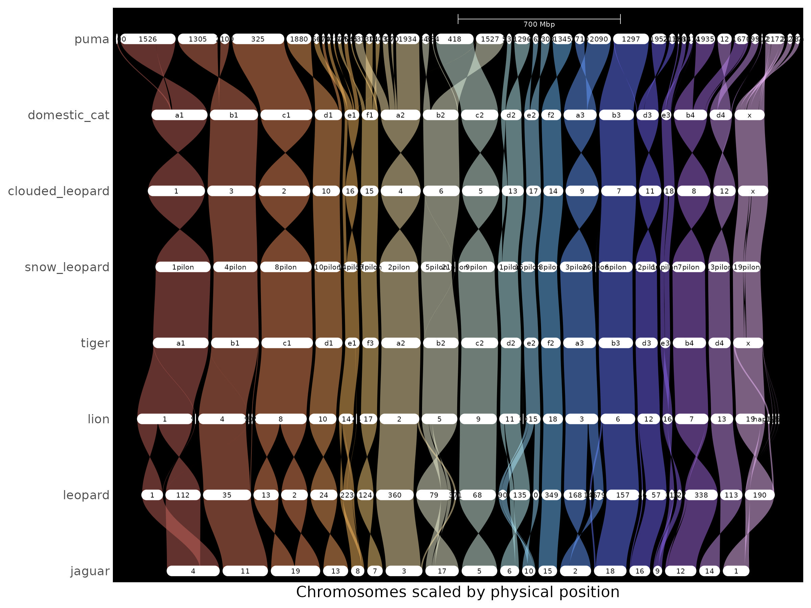
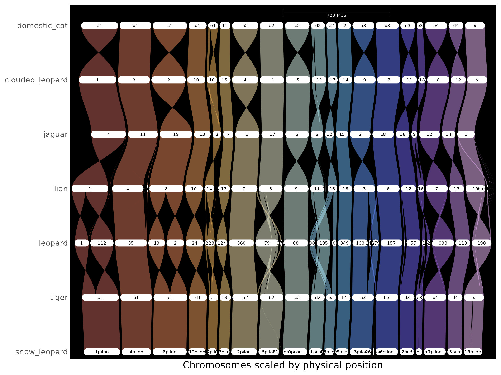
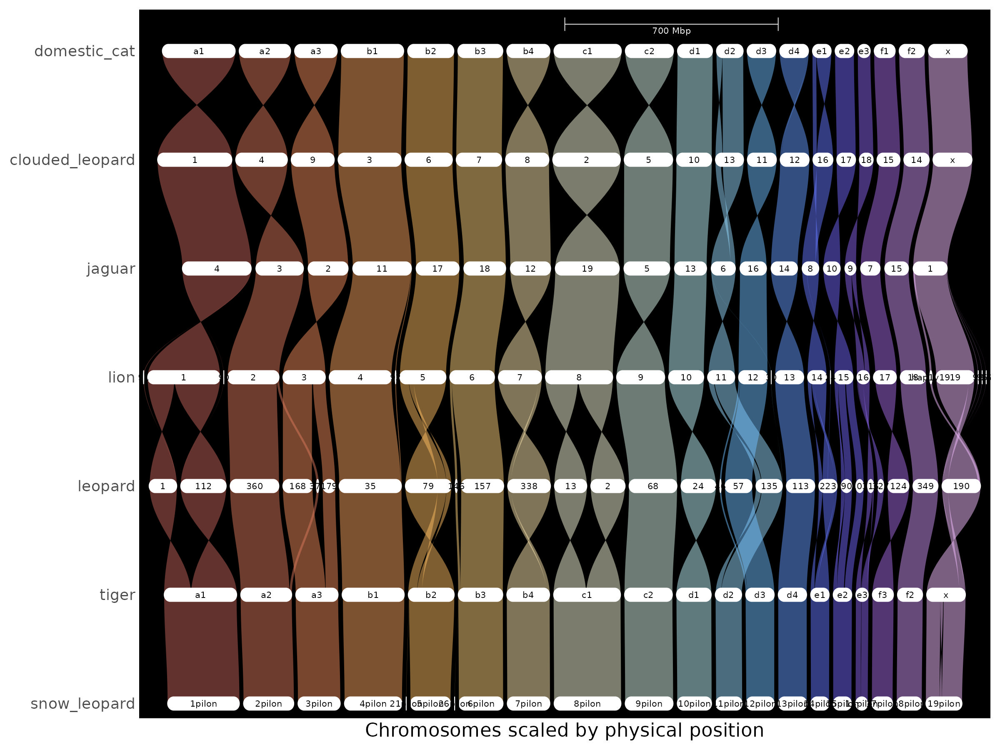
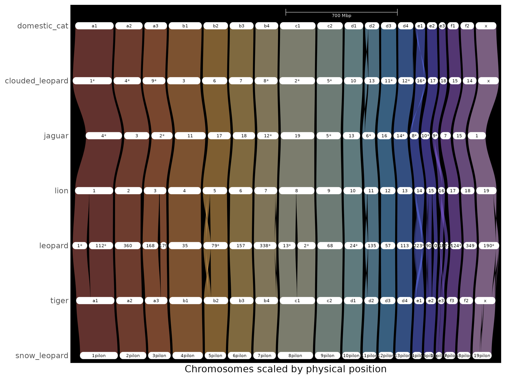

# Genespace_For_Beginners
## Intro
GENESPACE is a super cool tool that has a variety of functions, but in this tutorial we'll show you how to use it to visualize synteny between different species.

<details>
<summary><strong> Part 1: </strong> Installation and Environment Setup </summary>
We will execute GENESPACE in the R environment, but it requires several dependencies that are usually best installed and run on a high performance cluster or server, rather than on your local machine.

### 1. R
GENESPACE is meant to be run interactively in the R environment for statistical computing. So, you need to have R installed. See [CRAN](https://www.r-project.org/) for the most recent release.

### 2. Orthofinder
OrthoFinder (which includes `DIAMOND2`) is most simply installed via conda (in the shell, not R).
```{bash}
conda create -n orthofinder
conda activate orthofinder
conda install -c bioconda orthofinder=2.5.5
```
If conda is not available on your machine, you can install orthofinder from a number of other sources. See orthofinder documentation for details.
Regardless of how OrthoFinder is installed, ensure that you have OrthoFinder version >= 2.5.4 and DIAMOND version >= 2.0.14.152.

### 3. MCScanX
`MCScanX` should be installed from [github](https://github.com/wyp1125/MCScanX).

### 4. GENESPACE
Once the above dependencies are installed, start an R instance. If you made a conda environment, its useful to open R directly from that environment so that OrthoFinder stays in the path.
```{bash}
conda activate orthofinder
R
```
Once in R, the easiest way to install GENESPACE uses the package devtools (which may need to be installed separately):
```{R}
if (!requireNamespace("devtools", quietly = TRUE))
    install.packages("devtools")
devtools::install_github("jtlovell/GENESPACE")
```

### 5. Install R dependencies
If they are not yet installed, install_github will install a few dependencies directly (ggplot2, igraph, dbscan, R.utils, parallel). However, you will need to install the bioconductor packages separately:
```{R}
if (!requireNamespace("BiocManager", quietly = TRUE))
    install.packages("BiocManager")
BiocManager::install(c("Biostrings", "rtracklayer"))

library(GENESPACE)
```
</details>

<details>
<summary><strong> Part 2: </strong> Preparing the Required Input Files </summary>

GENESPACE requires three input files per genome. These files must be consistent with each other (same annotation, matching gene IDs). 

### 1. Genome sequece (`.fna`)
- FASTA file containing the DNA sequences of the genome assembly (chromosomes, scaffolds, or contigs).

Example:
```{text}
>chr1
ATGCGT...
```

### 2. Genome annotation (`.gff3`)
- GFF3 file describing where genes and their features are located on the genome.
- Includes positions for genes, transcripts, exons, and CDS regions.
- Must be valid GFF3 format (not all .gff files are compliant).

Key fields:
- Chromosome/contig name (must match .fna)
- Feature type (gene, mRNA, CDS, etc.)
- Start and end positions
- Strand (+ or -)
- Attributes (e.g., gene IDs)

Example:
```{text}
chr1  source  gene  1000  5000  .  +  .  ID=gene1
```

### 3. Protein sequences (`.faa`)
- FASTA file containing translated protein sequences from coding regions (CDS).
- Used for sequence similarity searches (e.g., DIAMOND) to identify homologous genes.

Example:
```{text}
>gene1
MTEYKLVVVGAGGVGKSALTIQLIQ...
```

### How these files relate
Each file represents a different layer of information:
- `.fna` → the DNA sequence
- `.gff3` → the gene locations and structure
- `.faa` → the protein sequences encoded by those genes

GENESPACE links these together to identify orthologs and syntenic regions across genomes.

### Critical requirements
- Matching IDs: Gene/transcript IDs in the `.gff3` must match sequence headers in the `.faa`.
- Same annotation source: All three files must come from the same genome build and annotation version.
- Consistent naming: Chromosome/contig names in `.gff3` must match those in `.fna`.
- Valid GFF3: Improperly formatted GFF files are a common source of errors.
</details>

## How to Run GENESPACE
**NOTE:** the following scripts and tutorials assume NCBI annotated genomes. If you have otherwise annotated genomes, see the [GENESPACE documentation](https://github.com/jtlovell/GENESPACE) for help. 

Now that we've installed all necessary packages and environments, we are ready to run GENESPACE!

### Step 1: Parse Annotations
Parse the annotations to fastas with headers that match a gene bed file. Use the built-in `parse_annotations` function in R:
```{R}
library(GENESPACE)

genomeRepo <- "~/path/to/store/rawGenomes"
wd <- "~/path/to/genespace/workingDirectory"
path2mcscanx <- "~/path/to/MCScanX/"

genomes2run <- ("list", "of", "genomes")

parsedPaths<- parse_annotations(
  rawGenomeRepo = genomeRepo,
  genomeDirs = genomes2run,
  genomeIDs = genomes2run,
  presets = "ncbi",
  genespaceWd = wd)
```
For example, if I were running the genomes of some species of *Panthera*, I would do the following:
```{R}
library(GENESPACE)

genomeRepo <- "data/cats/raw_genomes"
wd <- "results/cats"
path2mcscanx <- "/opt/linux/rocky/8.x/x86_64/pkgs/MCScanX/r51_g97e74f4"

genomes2run <- ("clouded_leopard", "domestic_cat", "jaguar", "leopard", "tiger", "puma")

parsedPaths<- parse_annotations(
  rawGenomeRepo = genomeRepo,
  genomeDirs = genomes2run,
  genomeIDs = genomes2run,
  presets = "ncbi",
  genespaceWd = wd)
```
### Step 2: Initialize GENESPACE Run
The function `init_genespace` does most of the heavy lifting in terms of checking to make sure that the input data is OK. It also produces the correct directory structure and corresponding paths for the GENESPACE run. 

```{R}
genomeIDs <- sub("\\.bed$", "", list.files(file.path(wd, "bed"), pattern = "\\.bed$"))

gpar <- init_genespace(
  genomeIDs = genomeIDs,		       
  wd = wd, 
  path2mcscanx = path2mcscanx)
```

### Running GENESPACE
We're now ready to actually run GENESPACE. Depending on parameter settings and genome size, this can take anywhere from a few min to several hours. 
```{R}
out <- run_genespace(gpar)
```

## Results
GENESPACE produces a structured output directory containing intermediate files and final results. Below is a brief description of the main folders:
```{bash}
bed/             → Gene coordinate files in BED format (derived from GFF3)
dotplots/        → Pairwise synteny dotplots between genomes
orthofinder/     → Orthogroup inference results (from OrthoFinder)
pangenes/        → Pangenome gene sets and clustering results
peptide/         → Processed protein sequences used in comparisons
rds/             → R serialized objects for downstream analysis/plotting
results/         → Final summarized outputs (core GENESPACE results)
riparian/        → Intermediate data for synteny graph construction
syntenicHits/    → Identified syntenic gene pairs across genomes
tmp/             → Temporary working files (can usually be ignored)
```
## Changing GENESPACE Synteny Plots
Sometimes, the plots it makes maybe don't list the species in the order you want, or it shows inversions where you know there aren't any. This can be fixed!

This is an image of my plot before doing anything custom:


For example, if I want to change the order of my species, I'll use the `genomeIDs` parameter in the `plot_riparian` function. As a note, the first listed species is going to be the one appearing at the bottom of the plot, and the last listed here will be the top:
```{R}
# plot BASE PAIR riparian
# changing useOrder to TRUE will result in gene order plot
rip <- plot_riparian(
  gsParam = out,
  useOrder = FALSE, 
  refGenome = "domestic_cat",
  genomeIDs = c(
    "snow_leopard",
    "tiger",
    "leopard",
    "lion",
    "jaguar",
    "clouded_leopard",
    "domestic_cat"
  )
```
That looks like this: 

I also want to use a custom chromosomal order, and I can do that here: 
```{R}
rip <- plot_riparian(
  gsParam = gparam,
  useOrder = FALSE,
  refGenome = "domestic_cat",
  genomeIDs = c(
    "snow_leopard",
    "tiger",
    "leopard",
    "lion",
    "jaguar",
    "clouded_leopard",
    "domestic_cat"
  ),
  customRefChrOrder = c(
    "A1","A2","A3",
    "B1","B2","B3","B4",
    "C1","C2",
    "D1","D2","D3","D4",
    "E1","E2","E3",
    "F1","F2",
    "X"
  ),
)
```
You can see that change here: 

Let's say that I also want to swap 2 chromsomes/scaffolds in the leopard, and 2 in jaguar. I would do that by first identifying those genomic regions:
```{R}
# identify the regions
invars <- list(
  leopard = c("79", "190"),  
  jaguar = c("6", "10")
)
# convert to format acceptible by GENESPACE
invchr <- data.table(
  genome = rep(names(invars), lengths(invars)),
  chr = unlist(invars)
)
```
And then adding it to the plotting function:
```{R}
rip <- plot_riparian(
  gsParam = gparam,
  useOrder = FALSE,
  refGenome = "domestic_cat",
  genomeIDs = c(
    "snow_leopard",
    "tiger",
    "leopard",
    "lion",
    "jaguar",
    "clouded_leopard",
    "domestic_cat"
  ),
  customRefChrOrder = c(
    "A1","A2","A3",
    "B1","B2","B3","B4",
    "C1","C2",
    "D1","D2","D3","D4",
    "E1","E2","E3",
    "F1","F2",
    "X"
  ),
  invertTheseChrs = invchr
)
```
I went ahead and cleaned up all the chromomsomes I wanted to swap. That cleans things up! And look like this:

